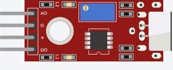

<!-- Generated by scripts/gen-parts.mjs — do not edit by hand. -->

Big Sound Sensor — Other part in the Velxio catalog.

## Pins

| Pin      | Signals |
| -------- | ------- |
| **AOUT** | —       |
| **GND**  | power   |
| **VCC**  | power   |
| **DOUT** | —       |

## Attributes

Editable from the [part inspector](/docs/circuit-editor/part-inspector/):

| Attribute | Default | Description |
| --------- | ------- | ----------- |
| `led1`    | `false` |             |
| `led2`    | `false` |             |

## Use it

Add it from the [component picker](/docs/circuit-editor/placing-components/) — search for “Big Sound Sensor” (tags: big-sound-sensor, big sound sensor, big, sound, sensor).
Right-click it on the canvas for the in-editor datasheet, and check the
[examples gallery](https://velxio.dev/examples) for circuits that use it.
