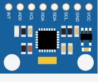

<!-- Generated by scripts/gen-parts.mjs — do not edit by hand. -->

MPU6050 — Sensors part in the Velxio catalog.

## Pins

| Pin     | Signals |
| ------- | ------- |
| **INT** | —       |
| **AD0** | —       |
| **XCL** | —       |
| **XDA** | —       |
| **SDA** | i2c     |
| **SCL** | i2c     |
| **GND** | power   |
| **VCC** | power   |

## Attributes

Editable from the [part inspector](/docs/circuit-editor/part-inspector/):

| Attribute | Default | Description |
| --------- | ------- | ----------- |
| `led1`    | `false` |             |

## Use it

Add it from the [component picker](/docs/circuit-editor/placing-components/) — search for “MPU6050” (tags: mpu6050).
Right-click it on the canvas for the in-editor datasheet, and check the
[examples gallery](https://velxio.dev/examples) for circuits that use it.
