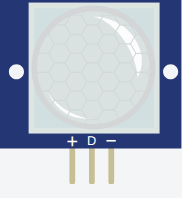

<!-- Generated by scripts/gen-parts.mjs — do not edit by hand. -->

PIR Motion Sensor — Sensors part in the Velxio catalog.

## Pins

| Pin     | Signals |
| ------- | ------- |
| **VCC** | power   |
| **OUT** | —       |
| **GND** | power   |

## Use it

Add it from the [component picker](/docs/circuit-editor/placing-components/) — search for “PIR Motion Sensor” (tags: pir-motion-sensor, pir motion sensor, pir, motion, sensor).
Right-click it on the canvas for the in-editor datasheet, and check the
[examples gallery](https://velxio.dev/examples) for circuits that use it.
