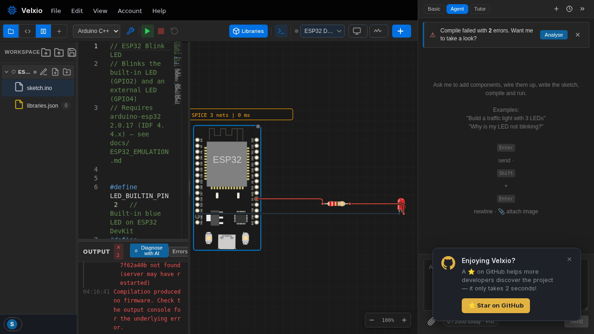

## What Run does

**Run** compiles the active board's code (if needed) and boots the result
on the emulated board. There is no "simulation of your source code" —
Velxio builds a **real firmware binary** with the real toolchain
(arduino-cli / ESP-IDF / MicroPython) and executes it instruction by
instruction.

- **Compile** (Ctrl+B) builds without running — useful to check errors
  fast.
- **Stop** halts the simulation; **Reset** reboots the firmware from the
  start.

## The Output console

The bottom-left **OUTPUT** panel streams the build: library resolution,
compiler invocations, memory usage, and finally
`Compilation successful`. It's the same output the Arduino IDE or
`idf.py build` would give you.

## Reading compile errors

Errors arrive exactly as the compiler emits them, with file and line:

- `'foo' was not declared in this scope` — typo or missing `#include`.
- `No such file or directory` for a header — the library isn't installed;
  add it via **Libraries** ([how](/docs/programming/libraries/)).
- Linker/section errors on huge sketches — the binary doesn't fit the
  selected board's flash.

Fix, press **Run** again. Builds after the first are much faster thanks to
caching.

> **Tip:** paste a compile error into the [AI assistant](/docs/ai/overview/)
> — explaining errors in context is what its Basic mode is best at.

## While it runs

- The **status dot** next to the board name in the file tree shows
  Idle / Compiled / Running.
- The **serial monitor** attaches automatically —
  see [Serial monitor](/docs/programming/serial-monitor/).
- Interact with the circuit live: press buttons, turn potentiometers,
  change sensor values from their control panels.
