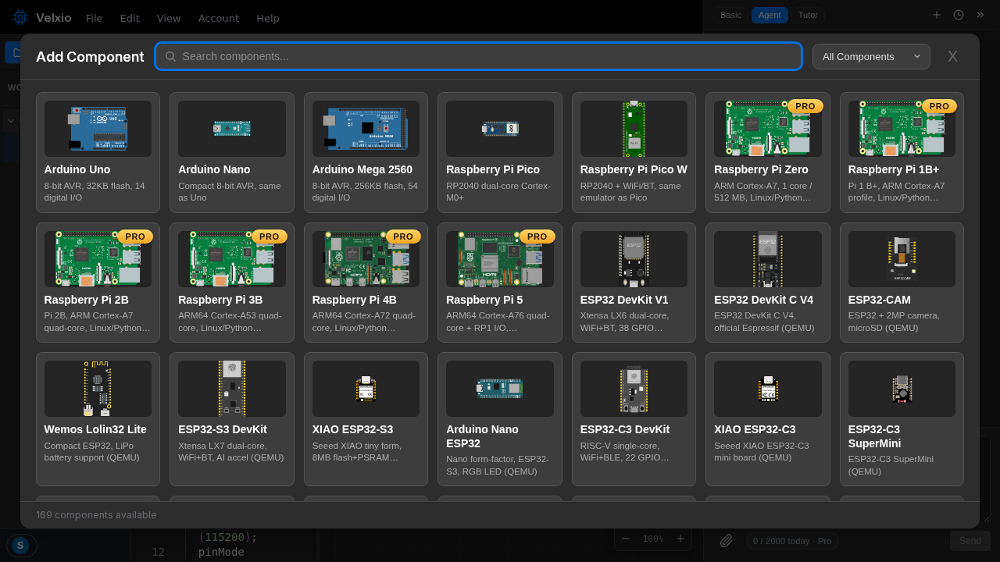

Clique em **Add** na barra de ferramentas (ou no botão **+** no canvas) para abrir
o seletor de componentes:

- **Search** por nome ou função: `oled`, `dht`, `resistor`, `servo`…
- **Filter** por categoria com o menu suspenso à direita — placas, displays,
  sensores, motores, lógica, componentes analógicos e módulos de marcas.
- Cartões com um **PRO badge** precisam de um plano pago para _executar_ — você pode ver o
  catálogo completo independentemente. Veja [planos](/docs/pt-br/getting-started/plans/).

Clique em um cartão e a peça cai no canvas. A partir daí:

- **Drag** para posicioná-la.
- **Click** para selecionar (um contorno tracejado mostra a seleção).
- **Right-click** para o [inspetor de peças](/docs/pt-br/circuit-editor/part-inspector/) —
  propriedades, pinagem, datasheet, girar e excluir.
- **Delete** ou **Backspace** remove a peça selecionada.

Toda peça no canvas está ativa durante a simulação: LEDs acendem, displays
desenham, botões clicam, sensores reportam os valores que você definiu neles.

O catálogo completo, com uma página por peça, está na
[referência de peças](/docs/pt-br/parts/overview/).
----- END PAGE -----
