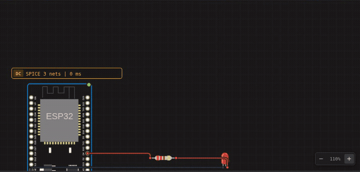

A maneira mais rápida de entender o Velxio é executar algo. Neste tutorial,
você abrirá o clássico exemplo _blink_ (piscar LED), executará, verá um ESP32
simulado acionar um circuito de LED real e, em seguida, alterará o código.



## 1. Abra o exemplo

Acesse [velxio.dev/example/esp32-blink-led](https://velxio.dev/example/esp32-blink-led)
(ou encontre **ESP32 Blink** na [galeria de exemplos](/docs/pt-br/getting-started/examples-gallery/)).


Você recebe um projeto completo: o **código** à esquerda (um sketch do Arduino que
alterna dois LEDs) e o **circuito** no meio — um ESP32 DevKit conectado
através de um resistor a um LED externo.

## 2. Pressione Run (Executar)

Clique no botão verde **Run** na barra de ferramentas (ou pressione **Ctrl+B** para
compilar primeiro). O Velxio compila seu sketch com a cadeia de ferramentas real do Arduino/ESP-IDF
na nuvem — o console **Output** (Saída) no canto inferior esquerdo transmite
o progresso do compilador, exatamente como o Arduino IDE faria.

A primeira compilação de uma sessão pode demorar um pouco; depois disso, as
compilações são muito mais rápidas.

## 3. Observe a execução

Quando a compilação termina, o firmware inicializa no ESP32 emulado:


Três coisas acontecem ao mesmo tempo:

- O **LED no canvas pisca** — a simulação aciona o componente
  real, através do resistor real.
- O **monitor serial** mostra o log de inicialização e depois `LED ON` / `LED OFF`,
  diretamente de `Serial.println()` no sketch.
- O **selo SPICE amarelo** acima do circuito mostra o mecanismo analógico
  resolvendo o caminho da corrente do LED.

## 4. Personalize

Edite o sketch — por exemplo, altere o atraso para fazer o LED piscar mais rápido:

```cpp
delay(100);   // era 500
```

Pressione **Run** novamente. Esse é o ciclo completo: editar, executar, observar.

## 5. Salve

Clique no **ícone de salvar** acima da árvore de arquivos (ou **Ctrl+S**), dê um
nome ao projeto e ele será armazenado na sua conta. Consulte
[Salvando e abrindo projetos](/docs/pt-br/getting-started/projects/).

> **Dica:** travou em algum ponto? Abra o assistente de IA à direita e pergunte —
> "por que meu LED não está piscando?" é um dos exemplos de prompt dele por um motivo.
> Consulte [Assistente de IA](/docs/pt-br/ai/overview/).

## Próximos passos

- [Tour pela interface](/docs/pt-br/getting-started/interface-tour/) — o que cada
  painel e botão faz.
- [Editor de circuitos](/docs/pt-br/circuit-editor/overview/) — construa um circuito do
  zero em vez de começar por um exemplo.
- [Placas suportadas](/docs/pt-br/boards/overview/) — troque o ESP32 por um
  Arduino UNO, um Pi Pico, um STM32…
