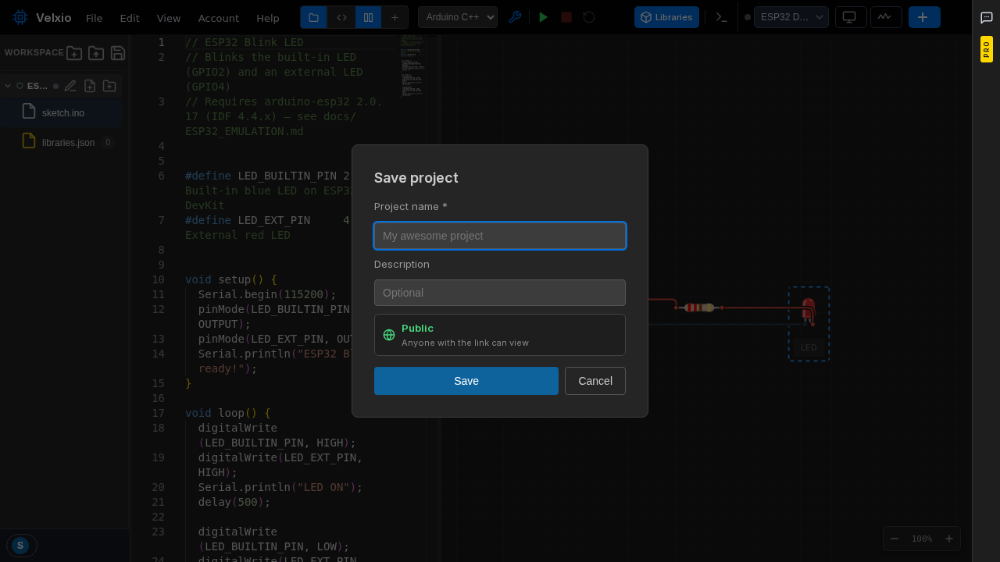
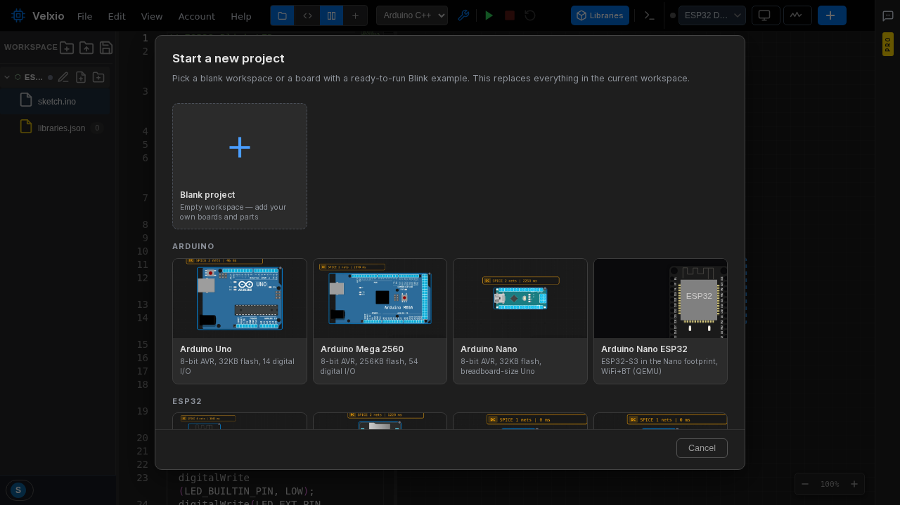

## Сохранение проекта

Нажмите **значок сохранения** над деревом файлов или нажмите **Ctrl+S**:

Дайте проекту имя и, при желании, описание. Настройка **видимости** определяет, кто может видеть проект:

- **Public** (Публичный) — любой, у кого есть ссылка, может просматривать проект.
- **Private** (Приватный) — только вы. Приватные проекты — функция платного тарифа; см. [тарифы](/docs/ru/getting-started/plans/).

Сохраненные проекты хранятся в вашем аккаунте и открываются с любого устройства после входа в систему.

## Начало нового проекта

Значок **нового рабочего пространства** над деревом файлов открывает выбор шаблона:

Выберите **пустой проект**, чтобы начать с чистого холста, или выберите плату, чтобы получить ее с готовым примером мигания светодиодом — сгруппировано по семействам (Arduino, ESP32 и т. д.).

:::caution
Начало нового рабочего пространства **заменяет все в текущем** — сначала сохраните, если хотите сохранить то, что у вас есть.
:::

## Открытие файла проекта

Значок **открытия** над деревом файлов загружает проект с диска:

- **`.vlx`** — собственный формат проектов Velxio (схема + код + библиотеки).
- **`.zip` (Wokwi)** — Velxio импортирует архивы проектов Wokwi, так что вы можете перенести свои существующие проекты Wokwi.

## Поделиться проектом

Сохраните проект как **Public** (Публичный) и поделитесь его URL-адресом. Любой, кто откроет ссылку, увидит схему и код и сможет запустить проект самостоятельно.
