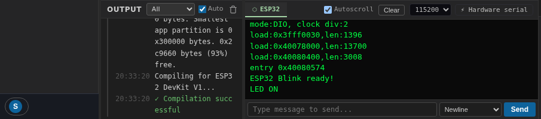

Переключите монитор последовательного порта с помощью кнопки **Serial** (Последовательный порт) на панели инструментов. Он
открывается как нижняя панель, **с одной вкладкой на каждую плату** в проекте:

Все, что выводит ваша прошивка (`Serial.println`, `print` в MicroPython,
журнал загрузчика ROM) отображается здесь в реальном времени — включая собственные
сообщения загрузки чипа, поскольку эмулятор загружает настоящую прошивку.

## Элементы управления

- **Baud rate** (Скорость передачи) — соответствует вашему `Serial.begin(...)`; обычно 115200.
- **Autoscroll** (Автопрокрутка) — следуйте за новейшими выводами; снимите флажок, чтобы прокрутить назад.
- **Clear** (Очистить) — очистить буфер.
- **Hardware serial** (Аппаратный последовательный порт) — указывает, что вкладка подключена к UART платы.

## Отправка ввода

Введите текст в **message box** (поле сообщения) внизу и нажмите **Send** (Отправить). Селектор
символа конца строки (Newline / Carriage return / оба / нет) важен для
скетчей, которые анализируют `Serial.read()` — так же, как и в мониторе
порта в Arduino IDE.

На платах MicroPython монитор последовательного порта также выполняет функцию **REPL**: остановите
ваш скрипт с помощью прерываний в стиле Ctrl+C и вводите команды Python в интерактивном режиме.
