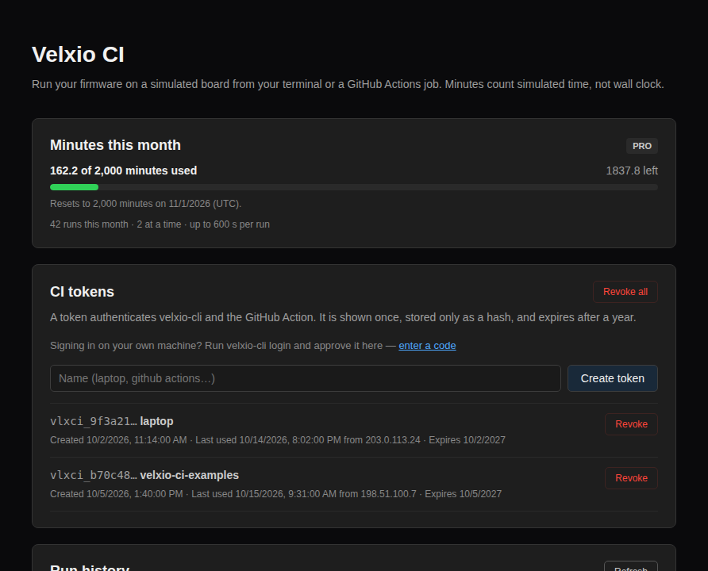

Velxio CI 让你在浏览器之外，通过我们的模拟器运行你的项目：你的终端、一个 GitHub Actions 任务，或任何能运行二进制文件的 CI。开发板会启动你真实编译出的固件，串口输出会流式返回，而当你所期望的事情没有发生时，命令会以非零状态退出。

```bash
curl -fsSL https://velxio.dev/ci/install.sh | sh
velxio-cli login                           # approve in the browser, once
cd firmware/blink
velxio-cli run --expect-text "Hello, world!" --timeout 10000 .
```

```
velxio-cli 0.2.1 · plan pro · 1998.3 of 2000 min left (resets 2026-10-01)
project blink (esp32-s3, 4 parts) · firmware build/blink.bin (ESP32 image, 912 KB)
run r_9f3c2a1b7e4d queued · budget 10.0 s simulated
Hello, world!
ok   wait-serial "Hello, world!" at 0.412 s
PASS in 0.41 s simulated (3.2 s wall) · billed 1 s · exit 0
```

## 它的用途

- **在硬件之前捕获固件回归。** 一个启动二进制文件并等待一行串口输出的测试只需一条命令；一个按下按钮、设置传感器并检查引脚的测试则是一个简短的 YAML 文件。
- **测试你无法一直放在桌面上的东西。** Velxio 模拟的每一块开发板都可供每个任务并行使用，无需实验室，也无需烧录。
- **沿用你现有的工具链。** 在前面的步骤中用 arduino-cli、ESP-IDF、PlatformIO 或 cargo 进行编译；Velxio 只运行编译产物。

## 费用如何计算

CI 按**模拟分钟**计费：即客户固件所认为已经过去的时间，而不是我们的服务器实际花费的时间。一个 10 秒的测试在每块开发板上都花费 10 秒，无论模拟器运行得比实时更快还是更慢。

| 方案  | 每月 CI 分钟数 | 同时运行的任务数 | 最长运行时间 |
| ----- | -------------------- | ------------ | ----------- |
| Free  | 无                 | 无         | 无        |
| Maker | 200                  | 1            | 5 分钟       |
| Pro   | 2,000                | 2            | 10 分钟      |

从未启动的运行（未知的开发板、与开发板不匹配的固件、被拒绝的场景）不产生任何费用。分钟数在每月第一天（UTC）重置。你的余额、运行历史和令牌位于 [/account/ci](https://velxio.dev/account/ci)：



## 项目如何描述自身

在你指向 CLI 的目录中有两个文件：

- `velxio.toml`：开发板和固件。Wokwi 的 `wokwi.toml` 也可以使用。
- `diagram.json`：电路。采用 Wokwi 的格式，因此现有的电路图可以原样运行。

当仅靠串口检查不够时，添加 `scenario.yaml`：它可以等待文本、发送文本、等待模拟时钟、检查引脚，以及设置部件上的控件。参见[场景](/docs/zh-cn/ci/scenarios/)。

## 下一步

- [快速开始](/docs/zh-cn/ci/quickstart/)：五分钟内完成第一次通过的运行。
- [velxio.toml](/docs/zh-cn/ci/velxio-toml/)：每一个键，以及路径如何解析。
- [场景](/docs/zh-cn/ci/scenarios/)：各个步骤及其含义。
- [GitHub Actions](/docs/zh-cn/ci/github-action/)：该 action 及其输入。
- [退出代码](/docs/zh-cn/ci/exit-codes/)：每一个对你的任务意味着什么。
- [从 Wokwi CI 迁移](/docs/zh-cn/ci/migrating-from-wokwi/)：有哪些变化。
