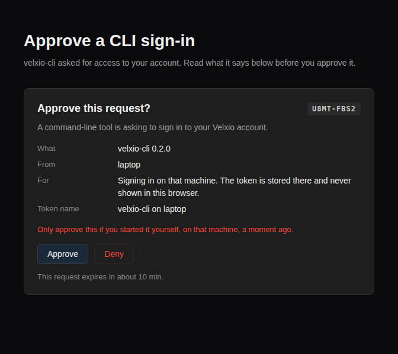

你需要一个付费方案下的 Velxio 账户，以及一个已编译的固件文件。模拟器在这里从不编译任何东西：请带上你自己的工具链生成的 `.hex`、`.bin`、`.uf2` 或 `.elf` 文件。

## 1. 安装 CLI

```bash
curl -fsSL https://velxio.dev/ci/install.sh | sh
```

它会在 `~/.velxio/bin` 中放入一个单独的二进制文件，并告诉你如何将其添加到 `PATH` 中。Windows：`iwr https://velxio.dev/ci/install.ps1 -useb | iex`。如果你更愿意自己获取，二进制文件位于[发布页面](https://github.com/velxio/velxio-cli/releases)。

## 2. 登录

```bash
velxio-cli login
```

它会打印一个短代码，打开你的浏览器并等待。批准请求后，CLI 会存储所获得的内容，因此你永远不需要在自己的机器上处理令牌。

```
code     7XJ6-33M5
approve  https://velxio.dev/account/ci/device?code=7XJ6-33M5
waiting for approval of 7XJ6-33M5 (the code expires in 10 min)
signed in as velxio-cli on laptop
```

在你批准任何内容之前，页面会显示是什么在请求、来自哪台机器以及请求什么：



CI 任务没有浏览器，因此它改为携带一个密钥。同样的流程会生成它，并以将持有它的仓库命名：

```bash
velxio-cli login --ci --name "my-firmware"
```

这个命令只会打印一次令牌。请将其存储为仓库密钥（在 GitHub 中：Settings、Secrets and variables、Actions），绝不要存储在仓库本身中。两种类型都会出现在 [velxio.dev/account/ci](https://velxio.dev/account/ci)，你可以在那里撤销任意一种。

## 3. 描述项目

在你的固件旁边放两个文件。`velxio-cli init` 会写入一对起始文件，或者你也可以手动编写：

```toml
# velxio.toml
[velxio]
version = 1
board = "esp32-s3"
firmware = "build/blink.bin"
```

```json
{
  "version": 1,
  "parts": [
    { "type": "board-esp32-s3-devkitc-1", "id": "esp", "top": 0, "left": 0 },
    {
      "type": "wokwi-led",
      "id": "led1",
      "top": 0,
      "left": 120,
      "attrs": { "color": "red" }
    },
    {
      "type": "wokwi-resistor",
      "id": "r1",
      "top": 60,
      "left": 60,
      "attrs": { "value": "220" }
    }
  ],
  "connections": [
    ["esp:2", "r1:1", "green", []],
    ["r1:2", "led1:A", "green", []],
    ["led1:C", "esp:GND.1", "black", []]
  ]
}
```

这就是 Wokwi 的 `diagram.json` 格式，因此现有的图表可以直接使用。

## 4. 运行它

```bash
velxio-cli run --expect-text "Hello, world!" --timeout 10000 .
```

固件启动，串口输出会实时显示，一旦文本出现，命令就会以 0 退出；如果十个模拟秒内没有出现，则以 42 退出。

```
velxio-cli 0.2.1 · plan pro · 1998.3 of 2000 min left (resets 2026-10-01)
project blink (esp32-s3, 3 parts) · firmware build/blink.bin (ESP32 image, 912 KB)
run r_9f3c2a1b7e4d queued · budget 10.0 s simulated
Hello, world!
ok   wait-serial "Hello, world!" at 0.412 s
PASS in 0.41 s simulated (3.2 s wall) · billed 1 s · exit 0
```

## 5. 放入 CI

```yaml
- name: Test with Velxio
  uses: velxio/velxio-ci-action@v1
  with:
    token: ${{ secrets.VELXIO_CLI_TOKEN }}
    path: firmware/blink
    timeout: 10000
    expect_text: "Hello, world!"
```

在更早的步骤中编译；这一步只运行你构建的内容。

## 当它不工作时

- **在任何东西运行之前出现 `exit 2`。** 这是配置问题：开发板不是 Velxio 运行的型号，固件与开发板不匹配，或者场景中有一个步骤命名了你的图表中不存在的部件。没有产生任何计费。`velxio-cli lint .` 可以在没有令牌和网络的情况下找出其中大部分问题。
- **`exit 3`。** 令牌缺失、已被撤销，或者属于没有 CI 的方案。
- **`exit 4`。** 本月没有剩余分钟数，或者同时运行的任务数超过了你的方案所允许的数量。
- **文本始终没有出现。** 提高 `--timeout`，然后在没有任何预期的情况下运行（`velxio-cli run --timeout 5000 .`），以查看固件实际打印的内容。
