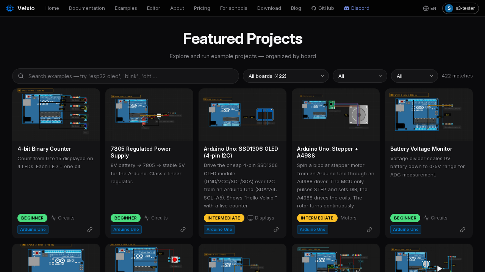

Velxio 内置了 **400 多个示例项目** 的画廊——每个项目只需单击一次即可在编辑器中打开，随时可以运行。这是您探索新开发板或新组件时最好的起点。

您可以在 [velxio.dev/examples](https://velxio.dev/examples) 找到它，或者通过网站导航中的 **Examples**（示例）进入。

## 查找示例

- **Search**（搜索）——尝试搜索部件或主题：`esp32 oled`、`blink`、`dht`…
- **Board filter**（开发板筛选）——只显示您关心的开发板的示例。
- **Difficulty**（难度）——入门 / 中级 / 高级。
- **Category**（类别）——电路、显示、电机等。

每张卡片都显示电路预览、目标开发板以及项目演示内容的简短说明。

## 使用示例

单击卡片，完整项目就会在编辑器中打开——电路已连接、代码已编写、库已声明。按下 **Run**（运行）即可运行。从那里开始，您可以将其视为自己的项目：编辑代码、添加部件，并[保存](/docs/zh-cn/getting-started/projects/)到您的账户。

示例也会从参考页面链接出来：每个[部件页面](/docs/zh-cn/parts/overview/)和[开发板页面](/docs/zh-cn/boards/overview/)都会指向使用该部件或开发板的示例，编辑器中的[部件检查器](/docs/zh-cn/circuit-editor/part-inspector/)也会列出您右键单击的部件的示例项目。
